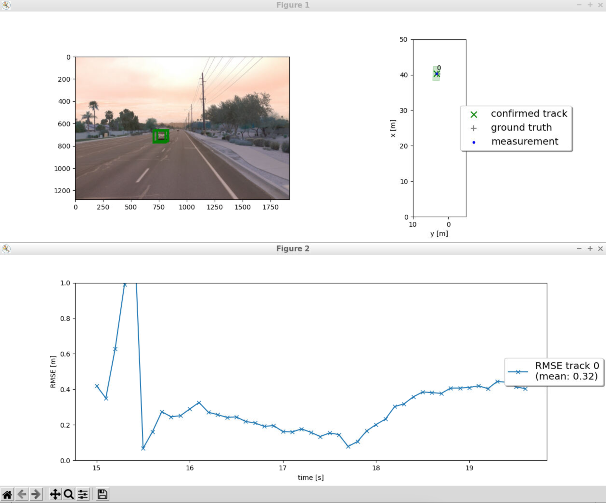
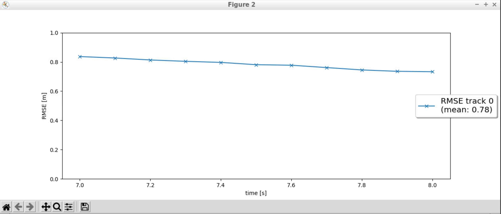
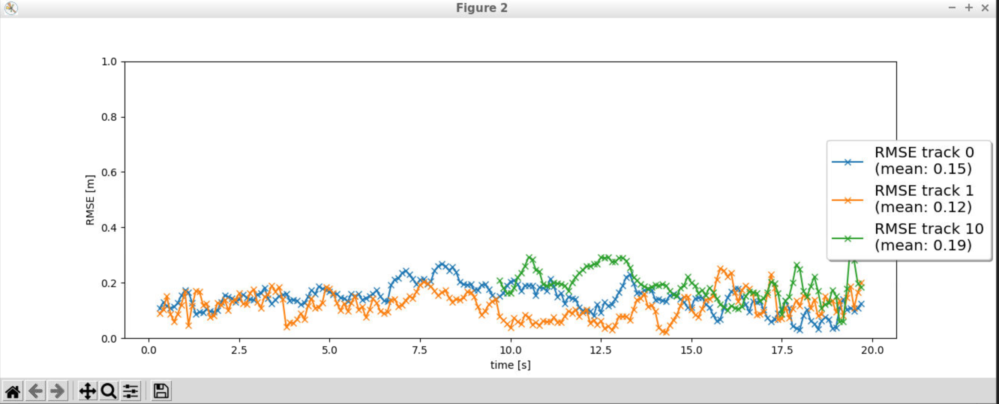
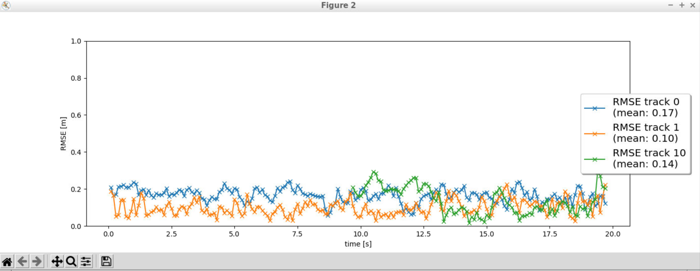

# Sensor Fusion Project Writeup

## Step 1: Extended Kalman Filter (EKF) Implementation

In the first step, the task was to implement the predict and update functions of an Extended Kalman Filter (EKF) for a 3D constant velocity model. The system matrix \( F \) and the process noise covariance matrix \( Q \) were computed based on a fixed timestep. The EKF was designed to handle both linear and nonlinear measurement models, making it suitable for lidar and camera measurements. The residual \( \gamma(x) \) and its covariance \( S \) were also calculated to correct the predicted state.

### Result:
The result was an RMSE plot with a mean value below 0.35, indicating that the filter successfully reduced the estimation error over time.

## Step 2: Track Management

The second step involved implementing track management, which included initializing tracks, updating their state, and managing their lifecycle. Tracks were initialized with measurements, and their state transitioned between 'INITIALISED', 'TENTATIVE', and 'CONFIRMED' based on their score. Tracks with low scores or high uncertainty were deleted.

### Result:
The visualization showed that tracks were correctly initialized, confirmed, and deleted based on the measurements. The RMSE plot confirmed that a single track was maintained without losses.

## Step 3: Data Association

In the third step, the Mahalanobis distance was used to associate measurements with tracks. An association matrix was created to find the best match between tracks and measurements. Gating was applied to ensure that only measurements within a certain threshold were considered for updating a track.

### Result:
The association worked effectively, ensuring that each measurement updated the correct track. The visualization confirmed that there were no confirmed ghost tracks, and all tracks corresponded to real objects.

## Step 4: Camera-Lidar Sensor Fusion

The final step involved implementing a sensor fusion system by combining lidar and camera measurements. The camera measurement model was nonlinear, requiring a projection from vehicle to sensor coordinates. The system also checked if objects were within the camera’s field of view before updating the tracks.

### Result:
The tracking loop successfully fused camera and lidar data, improving tracking accuracy. The final visualization showed that no confirmed ghost tracks existed, and the system tracked objects consistently across the sequence. The RMSE plot showed a mean value below 0.25 for three tracks that were tracked throughout the sequence.

**Screenshot:**

## Achievements and Challenges

This project demonstrated the successful implementation of a sensor fusion system, capable of tracking objects using real-world camera and lidar data. The most challenging aspect was tuning the EKF and managing the track lifecycle, especially balancing between false positives and track loss. 

## Camera-Lidar Fusion Benefits

Camera-lidar fusion offers several advantages over lidar-only tracking. Cameras provide rich visual information, which improves object classification and tracking in scenarios where lidar might struggle, such as detecting small objects or distinguishing between closely spaced objects. In this project, fusion improved the overall tracking accuracy, reducing RMSE and preventing ghost tracks.

## Real-World Challenges for Sensor Fusion Systems

In real-life scenarios, sensor fusion systems must handle challenges like sensor noise, occlusion, varying lighting conditions, and dynamic environments. The project hinted at these challenges, particularly with sensor alignment and dealing with false positives.

## Future Improvements

To enhance tracking results, future improvements could include:
- Implementing more sophisticated data association methods, such as the Joint Probabilistic Data Association (JPDA).
- Incorporating additional sensors like radar for even more robust tracking.
- Utilizing more advanced deep learning models for improved object detection and classification in the camera images.

